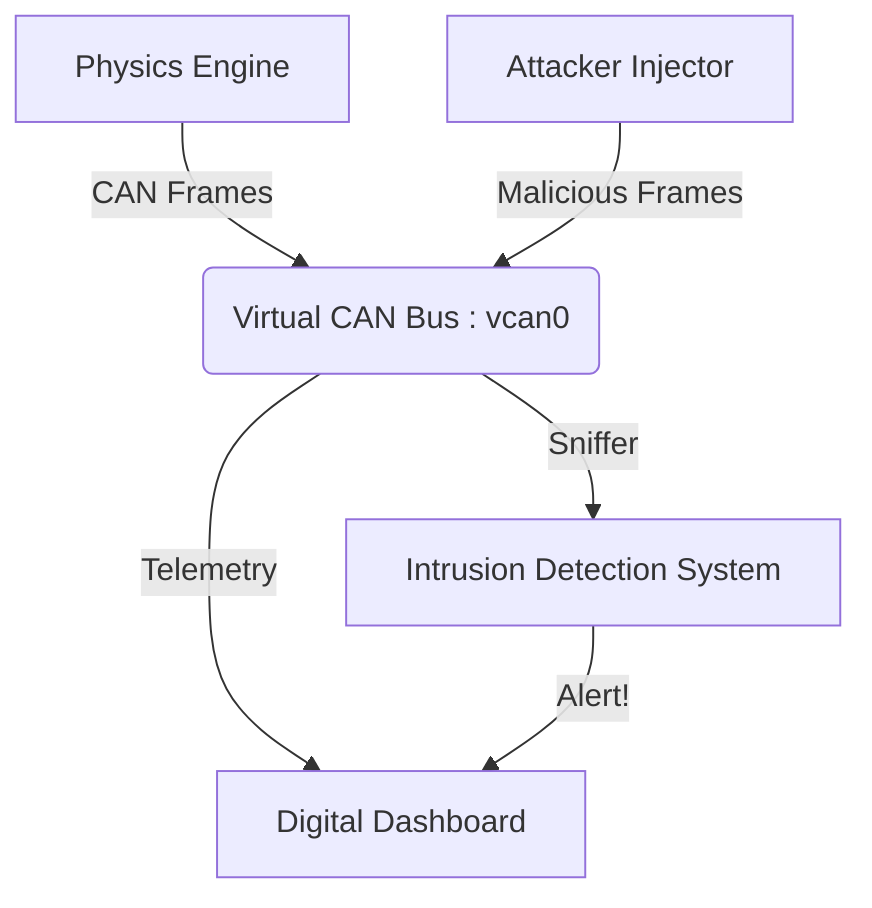

# CANSentinel // Automotive Intrusion Detection System


**CANSentinel** is a vehicle security workstation that simulates a modern "Digital Instrument Cluster" and demonstrates real-time CAN Bus attacks and defenses. It features a fully functional driving physics engine, a "Cyberpunk" style dashboard, and an integrated Intrusion Detection System (IDS) capable of spotting anomaly injections and safety violations.

> **Disclaimer**: This tool uses raw SocketCAN frames. Use only on virtual interfaces (`vcan0`) or isolated test benches. Do not run on a real vehicle while driving.

---

## 🚀 Features

### 1. Digital Instrument Cluster (Python)
*   **Visual Dashboard**: A futuristic GUI displaying Speed, RPM, Gear, and Door status.
*   **Physics Engine**: Simulates vehicle dynamics (acceleration, gear shifts) and broadcasts telemetry on the CAN Bus.
*   **Attack Simulator**: One-click injection of malicious frames (Speedometer Spoofing).
*   **Integrated IDS**: Visually alerts the driver when an intrusion or safety violation occurs.

### 2. Context-Aware Defense
*   **Flood Detection**: Flags high-frequency packet injections (e.g., Speedometer spoofing > 5ms intervals).
*   **Safety Logic**: Detects semantic violations, such as "Doors Opening" while the vehicle is in motion.

### 3. Low-Level IDS (C++)
*   **Headless Monitor**: A standalone C++ program (`ids_guard.cpp`) for high-performance sniffing and anomaly detection using raw sockets.

---

## 🛠️ Architecture



---

## 📦 Installation & Usage

### Prerequisites
*   **Linux** with `can-utils` (SocketCAN support)
*   **Python 3** (Tkinter, Socket)
*   **G++** (Optional, for C++ IDS)

### 1. Setup Virtual CAN
Initialize the `vcan0` interface to simulate the car's network.
```bash
sudo modprobe vcan
sudo ip link add dev vcan0 type vcan
sudo ip link set up vcan0
```

### 2. Run the Dashboard
Launch the main application. This starts the engine simulation and the IDS.
```bash
sudo python dashboard_gui.py
```
*Controls:*
*   **Start/Stop**: Toggle the engine physics.
*   **Unlock Doors**: Toggle door state (Try this while driving!).
*   **Inject Malicious Frames**: Simulate a hacking attack.

### 3. (Optional) Run Headless C++ IDS
For pure terminal-based monitoring.
```bash
g++ ids_guard.cpp -o ids_guard
./ids_guard
```

---

## 🎮 Demo Scenarios

### Scenario A: The "Speed" Hack
1.  Start the Engine and accelerate to ~50 KM/H.
2.  Click **"INJECT MALICIOUS FRAMES"**.
3.  **Result**: The speedometer will glitch, the background flows Red, and the IDS Warning will trigger "FLOOD DETECTED".

### Scenario B: The "Safety" Hack
1.  Accelerate to > 20 KM/H.
2.  Click **"UNLOCK DOORS"**.
3.  **Result**: The dashboard strictly locks down with "SAFETY VIOLATION: DOOR OPEN WHILE MOVING".

---

## 📸 Screenshots
*(Add screenshots of the Cyberpunk Dashboard here)*

---

## ⚠️ Legal & Ethics
Automotive security research requires strict adherence to safety protocols. This software is intended for **simulation only**. Never test on a live vehicle affecting critical control systems (steering, braking, engine) while the vehicle is in operations.
